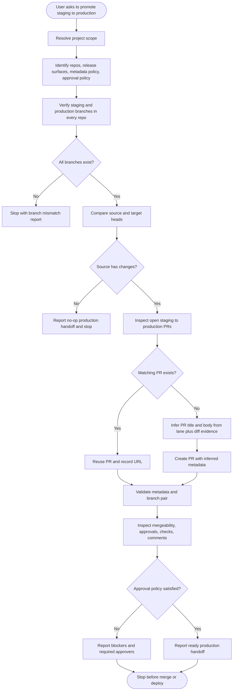

# promote-staging-to-production
A production release handoff skill for opening, reusing, and inspecting
`staging`-to-`production` promotion pull requests across a project-defined
repository set. The workflow validates branch state, infers promotion PR titles
and descriptions, validates metadata, checks production readiness, and reports
handoff status without merging or verifying deployments.

The skill is project-agnostic. Target projects supply the repository set,
release surfaces, approval policy, production ownership model, and any
post-merge verification requirements.

## Install

The fastest cross-agent install path is the `skills` CLI:

```bash
npx skills add gg-skills/promote-staging-to-production
```

Drop this skill into a workspace as a Git submodule for pinned versions, or as a plain clone for latest `main`:

```bash
# Project-local, version-pinned:
git submodule add git@github.com:gg-skills/promote-staging-to-production.git .claude/skills/promote-staging-to-production

# OR project-local, latest main:
mkdir -p .claude/skills
git -C .claude/skills clone git@github.com:gg-skills/promote-staging-to-production.git

# OR user-level, available in every project on this machine:
mkdir -p ~/.claude/skills
git -C ~/.claude/skills clone git@github.com:gg-skills/promote-staging-to-production.git
```

Restart your agent or reload skills after installation. See the parent [`skills` catalog repo](https://github.com/gg-skills/skills) for the full catalog.

## When to use

- The user asks to promote a frozen `staging` candidate into `production`.
- The operator needs production promotion PRs opened, reused, inspected, or metadata-validated.
- A production handoff report is needed before human approval or CI-owned deployment.
- A monorepo, multi-repo set, or submodule-aware release surface needs a readiness report.

Skip when the source branch is `main`, `development`, or a feature branch, when
the user wants direct production pushes, or when the user wants PRs merged or
live production smoke tests in the same workflow.

## How it operates

### Inputs

| Input | Purpose |
|-------|---------|
| Repository topology | Monorepo by default, multi-repo, or submodule-aware |
| Repository set | Repositories included in the production release |
| Release surfaces | Apps, packages, workspaces, or deployments affected |
| Source branch | Defaults to `staging`; verified remotely before mutation |
| Target branch | Defaults to `production`; verified remotely before mutation |
| Branch preservation | Source and target release branches are permanent and should not be deleted unless explicitly required and authorized |
| PR metadata policy | Optional title/body convention; otherwise inferred from lane, diff, scope, and handoff evidence |
| Approval policy | Human approval and branch-protection requirements |
| Root/meta policy | Whether a root or meta repository also needs a tracking PR |
| Verification owner | Person, CI workflow, or follow-up skill responsible after merge |

### Outputs

| Output | Description |
|--------|-------------|
| Plain-language progress updates | Explains each step before and after it runs, with what changed and what the user should do next |
| Branch verification report | Confirms source and target branch existence for every repository |
| Promotion PR inventory | Existing or newly created PR numbers, URLs, titles, and head SHAs |
| Metadata report | Notes whether each PR title/body matches the inferred or documented metadata policy |
| Production readiness report | Mergeability, approvals, checks, comments, and blockers |
| Link handoff packet | PR, compare, checks, deployment/dashboard, logs, and runtime links when applicable |
| Handoff summary | What is ready, what is blocked, and who owns production verification |

### Metadata and handoff behavior

The skill now infers PR metadata by default. A new PR gets a lane-derived title
and a body built from verified evidence: source and target SHAs, changed-file
risk, repository topology, release surfaces, review/check expectations,
production verification owner, and known unknowns. Use a project-provided title
or body pattern only when project docs or automation require it.

Progress reporting is part of the workflow. Before and after each meaningful
step, the agent explains what it is doing, why it matters, whether it changes
anything, what evidence was found, and what the user should do next. When a PR,
check, deployment, dashboard, log, compare, or runtime URL is discoverable, it
belongs in the handoff packet.

For `staging` to `production`, the skill stops at production PR handoff. It
validates PR metadata, branch direction, head SHA, mergeability, approvals,
checks, comments, and risky changed files, then reports readiness or blockers.
Production merge, deployment, and live smoke verification require separate
project authority.

### External commands

The skill uses read-mostly Git and GitHub CLI commands, creating a PR only when
no matching open promotion PR exists:

```bash
git ls-remote --heads <repo-url> staging production
gh pr list -B production -H staging -R <owner>/<repo> --state open --json number,url,title,body,headRefOid
gh pr create -B production -H staging -R <owner>/<repo> --title "<inferred-title>" --body-file <inferred-body-file>
gh pr view <number> -R <owner>/<repo> --json state,mergeable,mergeStateStatus,reviewDecision,statusCheckRollup,comments,reviews,url,headRefOid
gh pr checks <number> -R <owner>/<repo> --watch=false
```

### Side effects

- May create GitHub pull requests from `staging` to `production`.
- May leave comments only if the project workflow or operator requests them.
- Does not merge PRs.
- Does not direct-push `production`.
- Does not delete `staging`, `production`, or other source/target release branches unless project policy explicitly requires it and the user authorizes the exact repository and branch.
- Does not run or claim live production deployment verification.

### Mode toggles

| Mode | Behavior |
|------|----------|
| Discovery-only | Verify repositories, branches, and existing PRs without creating anything |
| PR handoff | Create or reuse PRs, validate inferred metadata, and report readiness |
| Blocker audit | Focus on approvals, mergeability, checks, comments, and ownership for already-open PRs |

## Operational flow



### Phase map

| Phase | What the agent does | Stop condition |
|-------|---------------------|----------------|
| Scope | Finds repo topology, release surfaces, metadata policy, and production approval policy | Required project inputs are unknown |
| Branch verification | Confirms `staging` and `production` exist in every repository | Any branch is missing or ambiguous |
| Diff gate | Confirms the staging candidate differs from production | Source and target are already equivalent |
| PR preparation | Reuses an open promotion PR or creates one with inferred title/body metadata | PR creation fails |
| Contract check | Verifies branch pair, inferred metadata, and head SHA for every PR | Metadata or branch pair is wrong |
| Production gate | Summarizes mergeability, approvals, checks, comments, and release ownership | Required approval or check is missing |
| Handoff stop | Ends before merge, deployment, or live production verification | Always stops here |

### Decision rules

- Explain each meaningful step before and after it happens, using beginner-friendly language.
- Include useful links and a clear next action whenever handing off a PR, deployment, check, or blocker.
- Reuse an existing open PR when the base is `production` and the head is
  `staging`.
- Create a PR only when the branches differ and no matching open PR exists.
- Infer PR title and body from the active lane, changed files, release surfaces, review/check expectations, and handoff owner before creating a new PR.
- Treat production approval as separate from green checks; both matter.
- Preserve source and target branches and warn the user not to click provider
  branch-deletion prompts for these permanent promotion branches.
- Report readiness; do not merge, push `production`, deploy, or claim live
  production smoke-test results.

## Layout

```
.
+-- SKILL.md                             # entry point with production handoff workflow
+-- agents/
|   +-- openai.yaml                      # agent / IDE descriptor
+-- references/
|   +-- staging-to-production-reference.md
|                                          # reusable command template and reporting contract
+-- assets/                              # skill icons and prompt sources
```

## Quick start

Read [`SKILL.md`](SKILL.md) first. It contains the branch defaults, required
project inputs, topology modes, PR metadata inference rules, plain-language
handoff requirements, useful-link inventory, PR creation/reuse rules, readiness
checks, and production handoff report format.

Load [`references/staging-to-production-reference.md`](references/staging-to-production-reference.md)
when you need the full command template for branch discovery, PR creation or
reuse, metadata validation, and production readiness inspection.

## Resources

- [SKILL.md](SKILL.md) - main production handoff workflow and safety rules
- [agents/openai.yaml](agents/openai.yaml) - agent / IDE descriptor
- [references/staging-to-production-reference.md](references/staging-to-production-reference.md) - command template and reporting contract
- [assets/](assets/) - skill icons and icon-prompt sources

## Caveats

- When a PR URL is provided, the user should open it, read the description, inspect Files changed, check Checks, and follow the project approval/merge policy.
- When Vercel is relevant, include deployment URLs, dashboard/project links, check links, and logs when they can be discovered.
- Branch names default to `staging` and `production`, but both must be verified
  remotely before mutation.
- Source and target branches are permanent promotion branches. Do not delete
  them after the PR is created or merged unless an explicit project policy and
  user authorization require it.
- This is a handoff workflow. Stop before merge, production deployment, or live
  smoke testing.
- Do not create duplicate promotion PRs. Reuse an existing open PR when the base
  and head branches match.
- New PRs should not have empty descriptions; include inferred scope, diff evidence, handoff status, and unknowns.
- Production promotion requires explicit human or project-policy approval. A
  clean check suite is necessary but not sufficient.
